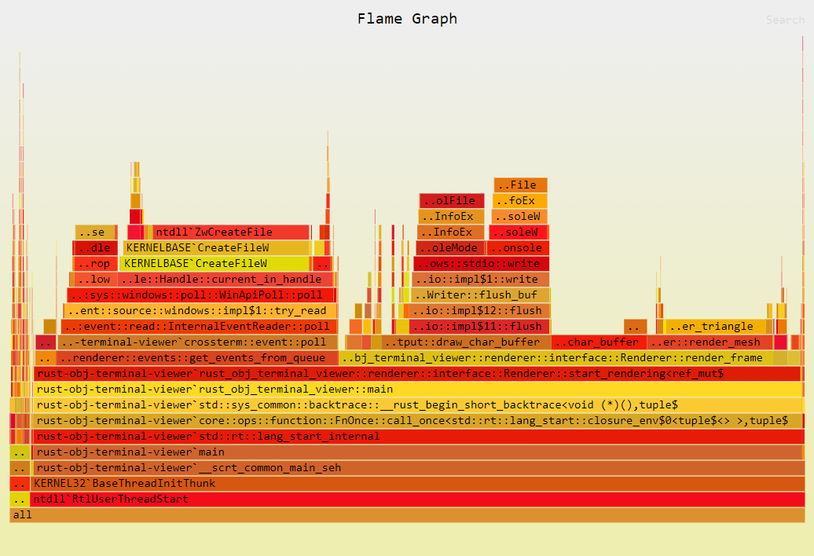

# Rust Obj Terminal Viewer
A CLI program to view 3D models directly in the terminal. Supports .obj files.

This program uses no graphics library. Perspective transformations, rasterization, etc are coded by hand. The 3D object is displayed in the terminal with ascii-characters.

## Development

### Running
Run `cargo run -- PATH_TO_OBJ_FILE_HERE`. Replace `PATH_TO_OBJ_FILE_HERE` with a path to a `.obj` file that you wish to view within the program.

Alternatively, run `cargo rhg` to open the program with `hourglass.obj`.

### Performance testing
In this repository there are multiple benchmarks for performance testing. To run a benchmark, run `cargo bench --bench BENCHMARK_NAME_HERE`.

### Performance profiling

To generate and open a flamegraph:
- Open a terminal window as administrator
- Make sure that flamegraph is installed. You can test this by running `cargo flamegraph --version`. To install flamegraph, follow [these instructions](https://github.com/flamegraph-rs/flamegraph?tab=readme-ov-file#installation). 
- Change working directory to the root of this repository
- Run 
`cargo flamegraph --output flamegraphs/graph-1.svg -- objects/hourglass.obj && start flamegraphs/graph-1.svg`
- Wait a few seconds and then press `q`

The flamegraph should now be generated and open automatically.
